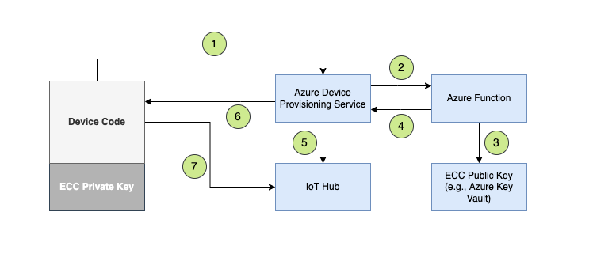

# Connecting to Azure IoT using JWT tokens signed using ECC certificates

When the devices are using JWT Tokens in your current solution, and you want to continue using them to authenticate because those certificates are pre-installed in your devices. In that case, you can create a Device Provisioning flow leveraging the Azure IoT Hub and Azure IoT Hub Device Provisioning Service as below:

Here are the steps to build the above provision flow demo

## Create ECC certificates

- Generate private and public keys using openssl

    - `openssl ecparam -genkey -name iotmigrationdemo -noout -out ec_private.pem`

    - `openssl ec -in ec_private.pem -pubout -out ec_public.pem`

## Create Azure IoT Hub and Device Provisining Service

- [Create IoT Hub](https://learn.microsoft.com/en-us/azure/iot-hub/iot-hub-create-through-portal)

- [Create Device Provisioning Service](https://learn.microsoft.com/en-us/azure/iot-dps/quick-setup-auto-provision) and link the IoT Hub created above

## Create Azure Function to validate JWT tokens

- Clone this repo and [configure your local environment](https://learn.microsoft.com/en-us/azure/azure-functions/create-first-function-vs-code-python#configure-your-environment) for Azure Functions.

- Create a new [Python function app using VS Code](https://learn.microsoft.com/en-us/azure/azure-functions/create-first-function-vs-code-python#publish-the-project-to-azure).

- Add the DEVICE_PUBLIC_KEY and IOT_HUB_HOSTNAME values in the local.settings.json file
    - `DEVICE_PUBLIC_KEY`:  ECC public key value from ec_public.pem file created previously. We will replace this with keyvault integration later.
    - `IOT_HUB_HOSTNAME`:  Hostname of the iot hub created in previous step

- Open the `ecc-jwt\function` folder and [Deploy the project](https://learn.microsoft.com/en-us/azure/azure-functions/create-first-function-vs-code-python#deploy-the-project-to-azure). Make sure to click on "Upload Settings" to upload the local settings data.

## Create Device Enrollment

- [Create new individual device enrollment](https://learn.microsoft.com/en-us/azure/iot-dps/how-to-manage-enrollments#create-an-individual-enrollment) in device provisioning service.

    - `Mechanism`: Symmeric Key
    - `Registration ID`: [unique device id]
    - `Select how to assign devices to hubs`: Custom (Use Azure Function)
    - `Function App`: [select function app created above]
    - `Function`: validatejwt

- You can also create enrollments using [command line](https://shell.azure.com)

    - `az iot dps enrollment create -n [device provision service name] --enrollment-id "[unique device id]" --attestation-type symmetrickey --allocation-policy custom --webhook-url "[function url]" --api-version "2021-10-01" --pk "[primary symmetric key]" --sk "[secondary symmetric key]" --iot-hubs "[linked iot hub name]"`

## Test the Python sample device code 

- Copy the ecc_private.pem file in the ecc-jwt\sample-device directory

- `pip install azure-iot-device`

- `cd ecc-jwt\sample-device`

- Update the id_scope, registration_id and symmetric_key values in the mydevice.py file

- `python .\mydevice.py`

## Additional Resources

https://learn.microsoft.com/en-us/azure/iot-dps/concepts-custom-allocation

https://learn.microsoft.com/en-us/azure/iot-dps/quick-create-simulated-device-x509?pivots=programming-language-python&tabs=linux

https://learn.microsoft.com/en-us/azure/iot-dps/tutorial-custom-allocation-policies?tabs=azure-cli

https://github.com/Azure/azure-iot-sdk-python/tree/main/samples/async-hub-scenarios

https://github.com/Azure/azure-iot-sdk-node/blob/main/provisioning/device/samples/register_symkey.js